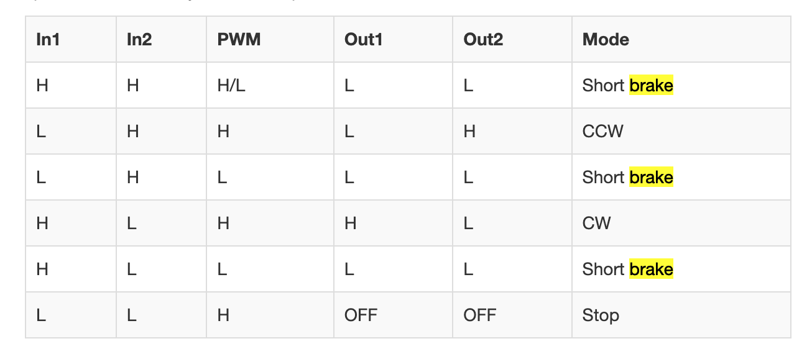

last-minute shopping list
- more heat-shrink
- female-female wires
- 24v supply
- 12v supply
- lipo batteries
- https://elmwoodelectronics.ca/products/adafruit-power-relay-featherwing

# Pin Info
//pinout data: https://learn.adafruit.com/adafruit-huzzah32-esp32-feather/pinouts 
https://cdn-learn.adafruit.com/assets/assets/000/109/517/original/adafruit_products_Adafruit_ESP32_Feather_V2_Pinout.png?1646778733 

ESP32 GPIO pins with Weak Pullup:12,13 (a12, 4 down on short side), 14

# sensors

// note there's an issue doing analog reads from many pins when Wifi is activated. The Following pinds should work (all on ADC 1):
* **A4**/36 ( 8 up from bottom on long side) - this is an analog input A4 and also GPI #36. Note it is _not_ an output-capable pin! It uses ADC #1
* **A3**/39 (9 up from bottom on long side)- this is an analog input A3 and also GPI #39. Note it is _not_ an output-capable pin! It uses ADC #1 
* **A2**/34 ( 7 down from top on long side) - this is an analog input A2 and also GPI #34. Note it is _not_ an output-capable pin! It uses ADC #1 
* **A13**/25 - This is general purpose input #35 and also an analog input A13, which is a resistor divider connected to the **VBAT** line (not sure where this is)

## Motion Sensor
https://elmwoodelectronics.ca/products/13285
requires pullup resistor (betweend alarm pin and power)
can't seem to get it to work, also reads as "motion detected"
also might not be very useful in a room where people are usually there.
ah, needs more than 3v of power - at least 5V, ideally 9v. 

## Flex Sensor
Channel: /?/flex
https://www.adafruit.com/product/1070
Connect one end of photo resistor  to 3V, the other end to Analog 4 (or whatever the analog read pin is).
Then connect one end of a 10K resistor from Analog read pin to ground 

 
## Moisture Sensor
Channel: /?/moisture
https://microcontrollerslab.com/esp32-iot-soil-moisture-monitoring-system-adafruit-io/ 
(the little attenuator knob sets the "on" value for the digital out)
Value out of soil: 4095
Value in moist soil: ~2000, each reading +/-50 (range of 100)
drier soil: ~3000

## Vibration Sensor
Channel: /?/vibration
/* A4 / 36 ( 8 up from bottom on long side) - 
 *  this is an analog input A4 and also GPI #36. 
 *  Note it is _not_ an output-capable pin! It uses ADC #1

// 3V is 2nd down from top on long 
// gnd is 4 down on long side
*/
/*
 * Connect one end of vibe sensore to GPIO 36, 
 * Connect other end to power .
 * Connect power to Ground with a 10k resistor 
 */
 The values flip back from  0 to 1 really fast...

## Photo Sensor
Channel: /?/light
(same as flex sensor)
Connect one end of photo resistor  to 3V, the other end to Analog 4 (or whatever the analog read pin is).
Then connect one end of a 10K resistor from Analog read pin to ground 
100k-200k photoresistor  Values: 
0 before total blackout (covered with hand @ 3")
~624 at desk light
~2600 at bright light

50k-100k Photoresistor
0 when touching directly to cover
~80 covered with hand @ 3"
~1150 desk light
~2080 bright light
needs smoothing

putting some heat-shrink around it to make it more directional…
doing that, it goes from 800-ish valuse to zero when a shadow passes over. great!

## Accelerometer
https://www.adafruit.com/product/4565 
Channel: /?/accelx
Channel: /?/accely
Channel: /?/accelz
// measures the speed and acceleration in 3 directions, not the absolute position.
// also can detect magnetic fields.…
https://learn.adafruit.com/lis3mdl-triple-axis-magnetometer?view=all 
// the magnetometer stuff does a pretty good job of orientation (good enough)

// and also temperature

Process for getting absolute position: https://learn.adafruit.com/how-to-fuse-motion-sensor-data-into-ahrs-orientation-euler-quaternions/calibration-pre-check
– geez that's complicated. I doubt it's worth the effort

# Actuators
seems like there are 2 analog out pins:
* **A0** - (5 down on long side) this is an analog input A0 and also an analog output DAC2. It can also be used as a GPIO #26. It uses ADC #2
* **A1** - (6 down on long side) this is an analog input A1 and also an analog output DAC1. It can also be used as a GPIO #25. It uses ADC #2
* **3v** - 2 down on long side
* **GnD** - 4 down on long side
* 
## cell motor
requires separate 3.7vLiPo battery
TB6612FNG motor driver
https://learn.sparkfun.com/tutorials/tb6612fng-hookup-guide
(but I'm not really using the grove driver code, I guess it wasn't working?)

STOP is more active, forceful
BRAKE is lazy, jsut sorta wheezes out…
Also usuing PWM to controle the speed, instructions here": https://gndtovcc.wordpress.com/2020/04/14/esp32-pwm-with-arduino-ide-analog-output/comment-page-1/ 

## continuous servo
FS90R
https://www.adafruit.com/product/2442 
https://docs.arduino.cc/learn/electronics/servo-motors  
issues with Servo.sh not running on esp32 https://rntlab.com/question/unit-9-esp32-control-servo-motor-library-problem/ 
using ESP32Servo library instead...
works off 3v from arduino, and when using 3.7v battery
 * Brown wire (black ) to ground * **GnD** - 4 down on long side
 * middle wire (orange) to Power (3v on arduino?) * **3v** - 2 down on long side
 * Yellow wire to Analog Out Pin: A0 (5 down on long side) 

## Mister
requires 24V/1Amp power supply

## Clapper Solenoid
works with 12V/.3A power supply

## Relay Board
for solenoid
https://elmwoodelectronics.ca/products/2-channel-dc-5v-relay-module
pinOut: A0/26
seems like I can control one relay with the arduino 3V, but can't control 2 relays; the device poops out, kinda just stops looping
- hm, even just controlling one, it poops out after a bit…
- seems to work better off battery?
- need to buy some 3v rated relays…
- 

## Big Solenoid
with 12V/.3a power supply, just barely holds it closed.
with 12V/1.25a power supply, it does a weird fluctuating thing: grabbing only at a certain range, then letting go. The power supply doing something strange in response to the current draw?

# Plants

## CyberPoop
Magnetometer on teh accelerometer acts like an expensive hall sensor.
sends message "1" on channel /poop

The server with the speakers makes a fart sound when it gets this messages

when other plants get this message they will feel "energized"

**DONE!**

## servo_light plant

this plant can move a branch with a directed light detector. 
in "search" mode it moves around until it finds the max light level, then points at the max light
when it's in alert mode, if it detects a change in light, it switches to "alert" mode and sends an OSC 'danger' message
when it RECEIVES a 'danger' message, it goes into 'search' mode.
IOW, it doesn't respond to its OWN danger messages.